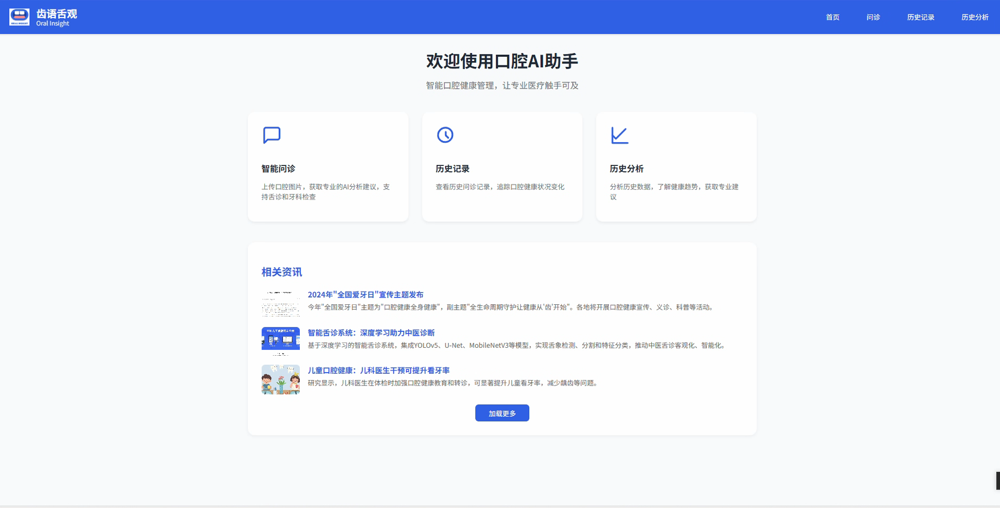
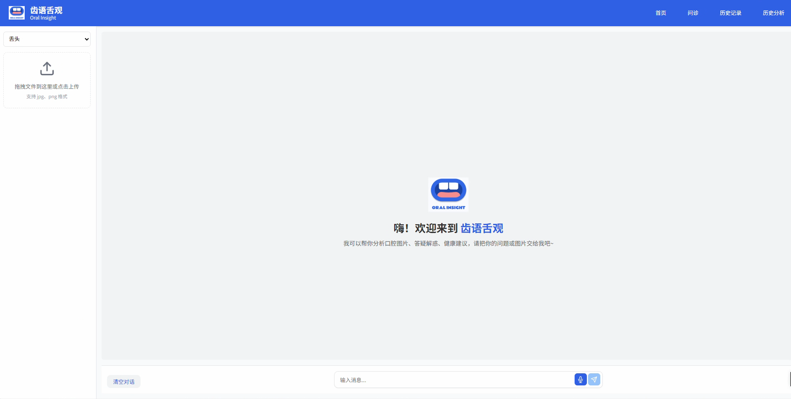

# 口腔AI系统项目

## 项目简介

本项目为口腔健康AI辅助系统，包含前端小程序、后端API服务、AI模型、以及相关数据集。系统可实现口腔图像分析、健康报告生成、语音识别、历史记录管理等功能，适用于口腔健康自助检测与科普。

## 目录结构

```
AI_System_Design/
├── dataset/              # 口腔相关数据集及处理脚本
│   └── oral/             # 细分的口腔疾病/特征数据
├── oral_ai_project/      # 后端API、AI模型、Web服务
│   ├── model/            # AI模型权重与推理接口
│   ├── routes/           # API路由
│   ├── database/         # 历史记录与标签
│   ├── templates/        # 网页模板
│   └── static/           # 静态资源
├── oral_app/             # 微信小程序（平板/PC端）
│   ├── pages/            # 页面代码
│   └── components/       # 组件
├── oral_app_phone/       # 微信小程序（手机端）
│   ├── pages/            # 页面代码
│   └── components/       # 组件
├── requirements.txt      # Python依赖（简版）
├── requirements_full.txt # Python依赖（完整版）
└── README.md             # 项目说明
```

## 安装依赖

1. 克隆本项目：

   ```bash
   git clone <本项目地址>
   cd AI_System_Design
   ```
2. 安装Python依赖：

   ```bash
   pip install -r requirements.txt
   # 或使用完整版依赖
   # pip install -r requirements_full.txt
   ```
3. 微信小程序端请使用微信开发者工具导入 oral_app/ 或 oral_app_phone/ 目录。
4. 下载模型权重文件：

   请前往百度网盘 [权重下载链接](https://pan.baidu.com/s/1AKsbSSCT8UkmUY5j1XEoPw?pwd=jxat) 下载以下模型权重文件，并放置到 `oral_ai_project/model/weights/` 目录下：

   | 文件名                                 | 作用/用途说明                             |
   | -------------------------------------- | ----------------------------------------- |
   | best_model.pth                         | 牙齿疾病分类主模型权重（EfficientNet）    |
   | efficientnet_b3_rwightman-cf984f9c.pth | EfficientNet-B3 预训练权重（牙齿分类）    |
   | yolov5.pt                              | YOLOv5 口腔/舌体检测模型权重              |
   | sam_vit_b_01ec64.pth                   | SAM（Segment Anything Model）舌体分割权重 |
   | tongue_color.pth                       | 舌色识别模型权重（ResNet）                |
   | tongue_coat_color.pth                  | 舌苔颜色识别模型权重（ResNet）            |
   | thickness.pth                          | 舌苔厚薄识别模型权重（ResNet）            |
   | rot_and_greasy.pth                     | 舌苔腐腻识别模型权重（ResNet）            |
   | unet.pth                               | 口腔/舌体分割辅助模型权重                 |


   > **注意**：所有权重文件需放置于 `oral_ai_project/model/weights/` 目录下，否则模型加载会失败。
   >
5. （可选）下载微调后本地LLM，可前往 [LLM权重下载](https://pan.baidu.com/s/1C3u2zEMvlJixOTLLpM4hjg?pwd=wujz) 下载必要LLM权重，并在 `oral_ai_project/model/llm_interface.py` 中设置 `model_dir`
6. 设置个人API：

   1. 在 `oral_ai_project/model/llm_interface_api.py` 中填写个人API，实现 deepseek 实时对话
   2. 在 `oral_ai_project/speech_recognition.py` 中填写个人API，实现语音转文字实时交互，具体参考 [短语音识别标准版_短语音识别-百度AI开放平台](https://cloud.baidu.com/product/speech/asr)

## 运行方式

### 启动后端服务

进入 `oral_ai_project/` 目录，运行主程序：

```bash
cd oral_ai_project
python app.py
```

注意运行 app.py 前必须保证工作路径在 oral_ai_project 目录下，否则路径报错。后端服务默认监听本地端口（可在代码中修改）。
（注：oral_ai_project 本身可作为网页端程序使用）

### 启动小程序前端

1. 打开微信开发者工具，导入 `oral_app/` 或 `oral_app_phone/` 目录。
2. 配置后端API地址（如有需要）。
3. 预览或上传小程序。

## 主要功能模块

- **口腔图像分析**：基于深度学习模型自动识别舌象、牙齿等口腔特征。
- **健康报告生成**：根据分析结果自动生成健康建议与报告。
- **语音识别**：支持语音输入，提升交互体验。
- **历史记录管理**：保存用户历史检测记录，便于追踪健康变化。
- **多端支持**：支持PC/平板端与手机端微信小程序。

## 数据集说明

- `dataset/` 目录下包含多种口腔疾病、舌象、牙齿等相关的标注数据与问答数据。
- 数据格式多为 JSON，便于AI模型训练与推理。
- 具体数据集说明可参考各子目录下的 `README` 或 `original.md` 文件。

## demo




